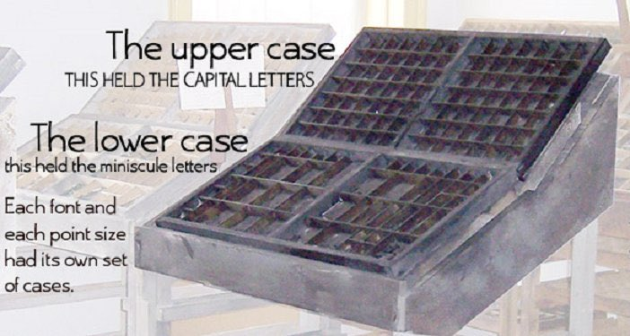
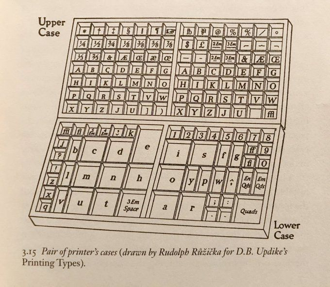
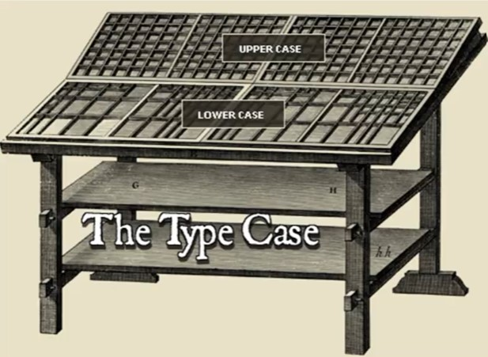

- 영문 대문자는 매저스큘(majuscule)이라고 부른다. (원래 대문자밖에 없었음)
- 작고 둥글게 빨리 쓰고 가독성이 좋은 경향으로 미니스큘(minuscule)이라고 부르는 소문자가 생김
- 활자 상자를 보면 윗 상자(Upper case)에는 대문자를 아래 상자(Lower case)에는 소문자가 있는(자주 사용하니 손이 잘 닿는 위치에) 것을 확인할 수 있다

